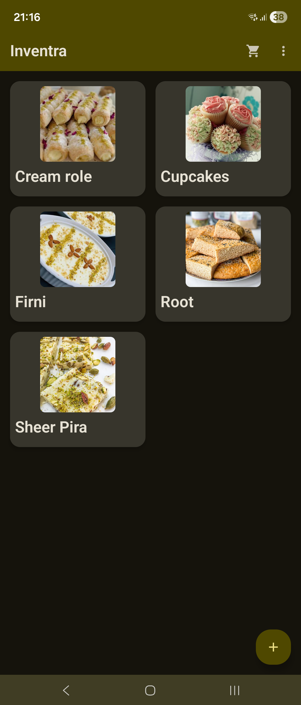
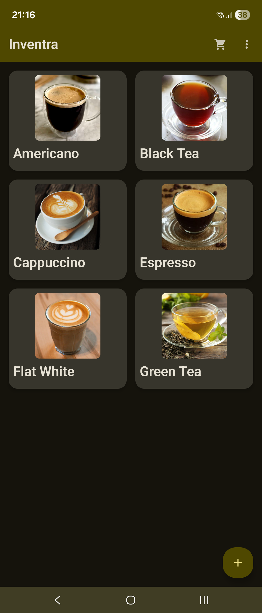
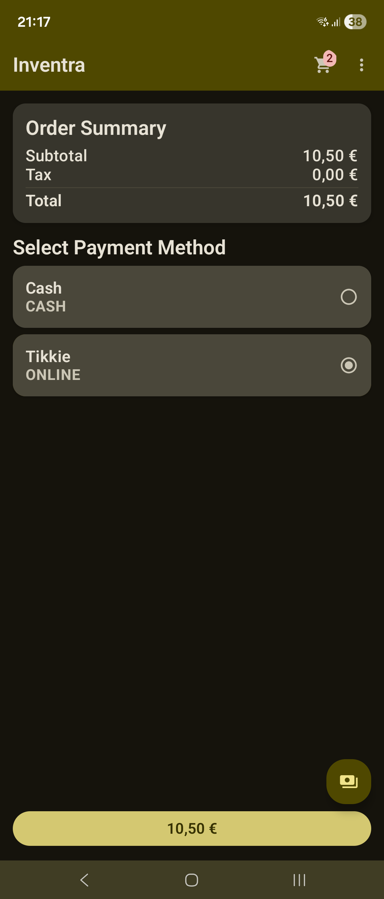

# Inventra

> **Inventra** — an offline-first, open-source inventory and sales tracker built with Kotlin Multiplatform.

---

## About

Inventra helps **small vendors**, **event sellers**, and **home businesses** manage products, stock, and sales — even without internet.  
It supports **QR payments**, **tax tracking**, and **custom API integration** for syncing data when online.

Built with **Kotlin Multiplatform (KMP)** and **Compose Multiplatform**, Inventra brings a modern, fast, and flexible experience to Android, Desktop, and future platforms.

## Screenshots





---


## ✨ Key Features

- **Offline-first**: All data stored locally with optional online sync
- **Admin & Seller modes**: PIN-protected editing and management
- **Multi-level navigation**: Categories → Products → Offers
- **Inventory tracking**: Real-time stock updates with history log
- **Sales tracking**: Split payments, QR-based transfers, tax calculation
- **Configurable API**: Define your own host and endpoints in-app
- **Dark mode** and **edge-to-edge UI**
- **Open-source**, modular, and privacy-friendly

---

## Architecture

| Layer | Technology |
|--------|-------------|
| **UI** | Compose Multiplatform |
| **Core logic** | Kotlin Multiplatform shared module |
| **Database** | SQLDelight |
| **Networking** | Ktor Client |
| **Serialization** | Kotlinx Serialization |
| **Settings** | Multiplatform Settings |
| **Testing** | Kotlin Test / MockK |

The app follows a **Clean Architecture + MVVM** structure, ensuring testability and scalability.

---

## Data Model Overview

```
Category → Product → Offer → Sale → Payment
             ↳ InventoryTransaction
             ↳ Event (session tracking)
```

👉 See [`/docs/data_model_diagram.md`](./docs/data_model_diagram.md) for the full entity diagram.

---

## Payments

- Supports multiple payment methods: `cash`, `card`, `qr`, `other`
- QR payments are generated offline (EPC standard)
- Split payments allowed (e.g., half cash, half QR)
- Taxes inherit from category but can be overridden per offer

---

## ⚙️ Configuration

Users can connect their own API:

```yaml
baseUrl: https://example.com/api
endpoints:
  categories: /categories
  products: /products
  offers: /offers
  sales: /sales
  sync: /sync
auth:
  token: <optional>
```

All credentials and settings are stored locally and encrypted.

---

## Tech Highlights

- Kotlin Multiplatform Shared Logic
- Compose Multiplatform UI
- SQLDelight Offline Database
- Ktor Networking
- Multiplatform Settings for Secure Config
- Local QR Generation (No network needed)
- Cross-platform ready (Android, Desktop, iOS, Web)

---

## Roadmap

| Version | Features |
|----------|-----------|
| **v1.0 (MVP)** | Offline products, offers, sales, payments, events |
| **v1.1** | CSV/PDF export, tax reporting, QR payment confirmation |
| **v1.2** | Multi-seller sync, analytics dashboard |
| **v2.0** | iOS & Web support |

---

## Development Setup

### Prerequisites
- Android Studio Ladybug+
- Kotlin 2.0+
- Compose Multiplatform enabled
- SQLDelight and Ktor plugins

### Build
```bash
./gradlew build
```

### Run Android
```bash
./gradlew :androidApp:installDebug
```

### Run Desktop
```bash
./gradlew :desktopApp:run
```

---

## Contributing

Contributions are welcome!  
Fork the repo, create a feature branch, and submit a PR.

Please ensure:
- Code is **documented** and **unit-tested**.
- UI changes respect **dark mode** and **accessibility**.
- Commit messages follow conventional format (feat:, fix:, docs:, etc.)

---

## License

This project is licensed under the **MIT License** — see the [LICENSE](./LICENSE) file for details.

---

### About the Name

**Inventra** = *Inventory* + *Infra* (infrastructure).  
A platform-independent, offline-first toolkit for managing what matters most — your stock, sales, and flow.

---

**Inventra** — *Track, sell, and sync — anywhere, anytime.*